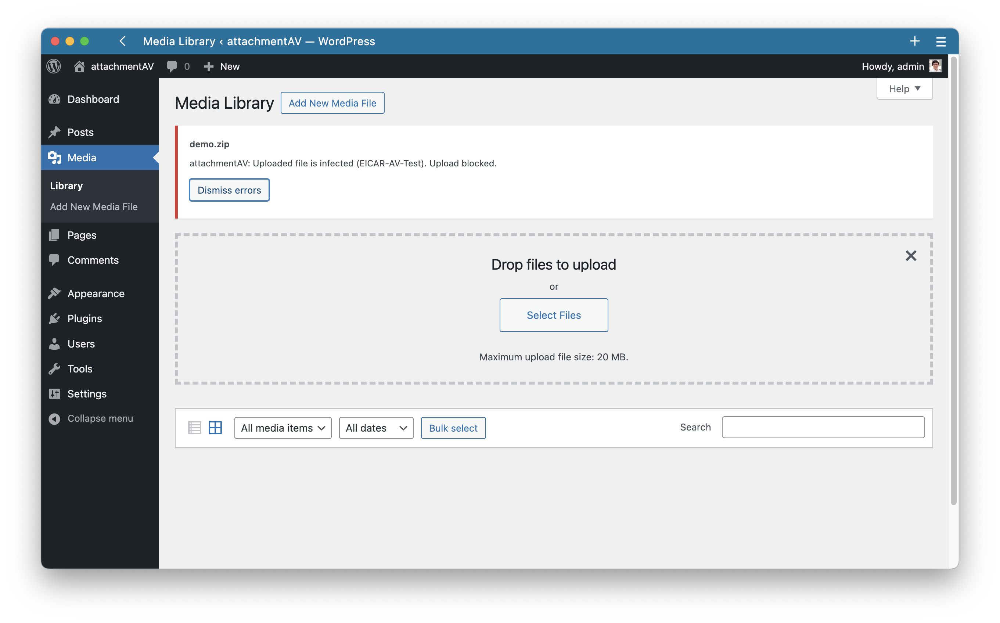

# attachmentAV for Wordpress - Protect blog from viruses, trojans, and other kinds of malware

Protect your blog from viruses, trojans, and other kinds of malware. The plugin sends all uploads to the attachmentAV API to scan for malware with Sophos and blocks infected files.

> This plugin requires a subscription and API key: [Get API key](https://attachmentav.com/subscribe/wordpress/)

## Screenshot

The Wordpress plugin scans uploads for viruses, trojans, and other kinds of malware. Infected files are rejected during the upload.



## Installation

> [Looking for more detailed installation instructions?](https://attachmentav.com/help/setup-guide/wordpress.html)

1. Install attachmentAV either via the WordPress.org plugin repository or by uploading the files to your server. (See instructions on [how to install a WordPress plugin](https://www.wpbeginner.com/beginners-guide/step-by-step-guide-to-install-a-wordpress-plugin-for-beginners/))
1. Activate attachmentAV.
1. Open the attachmentAV plugin settings tab.
1. Create a subscription for the attachmentAV API and enter the API key.

## Help and Feedback

Please contact [hello@attachmentav.com](mailto:hello@attachmentav.com) in case you need help or want to leave feedback. Alternatively, open an issue or send a PR.

## Development

To clear the database, run:

```
docker compose down --volumes
```

Use the following command to spin up a development environment.

```
docker compose up
```

To make email work:

```
docker ps
CONTAINER ID   IMAGE                  COMMAND  
93b4f65875ae   wordpress:latest       "docker-entrypoint.s…"   6 hours ago   Up 6 hours   0.0.0.0:80->80/tcp                  attachmentav-wordpress-wordpress-1

docker exec -it 93b4f65875ae /bin/bash

apt-get update && apt-get install -y sendmail && apt-get clean
/usr/sbin/sendmail -bd
```

Optionally use `ngrok` to get a publicly reachable development domain.

```
ngrok http http://localhost:80
```

> You might need to set the `siteurl` an `home` option in [phpMyAdmin](http://localhost:8081/index.php?route=/sql&pos=0&db=wordpress&table=wp_options) to `http://localhost` or the ngrok URL if this changed since last time.

Inside PHP, use `error_log('log line');` or `error_log(print_r($var, true));` to print debug logs.

### Release

* Modify `plugin/README.md`
  * Update `Stable tag`
  * Add an item to `Changelog`
* Modify `plugin/attachmentav.php`
  * Update the `ATTACHMENTAV_VERSION` constant
  * Update `Version` (line 19)
  
* Commit changes.
* Add and push tag:
```
git tag -a v1.0.5 -m "v1.0.5"
git push origin main --tags
```

The workflow `release` will synchronize the repository with the WordPress SVN to publish the release.
